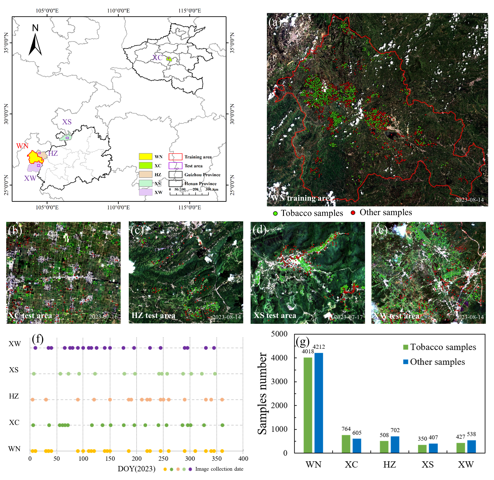
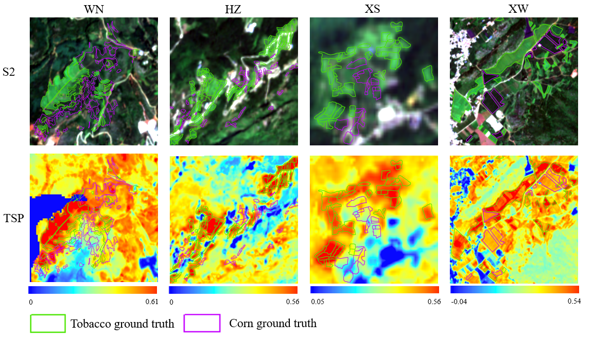
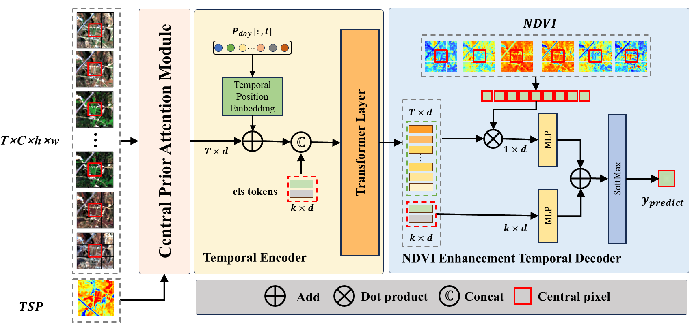

# **TSP-Former: A Phenology-Guided Transformer for Tobacco Mapping Using Satellite Image Time Series**

[](https://ieeexplore.ieee.org/document/11302804)
[](https://pytorch.org/)
[](LICENSE)

> **Official implementation of "TSP-Former: A Phenology-Guided Transformer for Tobacco Mapping Using Satellite Image Time Series"**
>
> **Authors:** Huaming Gao, Yongqing Bai, Qing Sun, Haoran Wang, Xiangyu Tian, Hui Ma, Yixiang Li, Xianghong Che, and Zhengchao Chen.
>
> Published in *IEEE Journal of Selected Topics in Applied Earth Observations and Remote Sensing (JSTARS)*, 2025.

---

## **📖 摘要 (Abstract)**

烟草是一种对物候敏感的重要经济作物。精准、及时地获取其空间分布对于农业规划至关重要。然而，现有方法——尤其是深度学习模型——常受限于**同物异谱/异物同谱**现象以及跨区域种植模式的差异，导致泛化能力不足。

为解决这一挑战，本研究提出了一种由物候先验知识引导的深度学习框架——**TSP-Former**。该框架创新性地引入了**烟草光谱物候变量 (TSP)**，并结合 Transformer 架构，实现了对多源卫星影像时间序列（SITS）的高效解译。实验表明，TSP-Former 在跨区域烟草制图中具有卓越的鲁棒性。

<div align="center">
  
  <p><em>图1：研究区概览（主要烟草种植区示意）。</em></p>
</div>

## **🌟 核心痛点与解决方案 (Methodology)**

### **1. 核心挑战**

* **光谱混淆 (Spectral Confusion)**：在特定生长期，烟草与玉米等作物的光谱特征高度相似，难以区分。  
* **泛化瓶颈 (Generalization Gap)**：不同地域的种植时间表（物候）和环境差异巨大，导致在一个区域训练的模型难以迁移到新区域。

### **2. 烟草光谱物候变量 (TSP)**

我们通过时序分析发现，烟草在快速生长期（T₁ → T₂），其 **红边-2 (Red Edge-2)** 波段的反射率增长速率显著高于玉米等其他作物。基于此，我们构建了 **TSP (Tobacco Spectral-Phenological)** 变量作为强先验知识。

<div align="center">
  
  <p><em>图2：TSP 变量可视化。暖色调区域清晰地突显了烟草种植区，有效抑制了背景干扰。</em></p>
</div>

### **3. TSP-Former 网络架构**

基于 TSP，我们设计了一个双流融合的 Transformer 架构：

* **🧠 中央先验注意力模块 (CPAM)**：采用双流特征融合策略，将 TSP 先验动态注入到中心像素的光谱特征中。  
* **📉 NDVI 增强时序解码器 (NDTD)**：利用 NDVI 时间序列对 Transformer 的输出进行加权，迫使模型关注作物生长的关键物候窗口。

<div align="center">
  
  <p><em>图3：TSP-Former 模型整体架构图。</em></p>
</div>

## **📊 实验结果 (Results)**

我们在中国四个主要的烟草种植区（威宁、赫章、习水、襄城）进行了广泛的测试。TSP-Former 在跨区域测试中展现了优异的泛化能力，尤其是在挑战性较大的区域。

| Model | HZ (OA) | XC (OA) | XS (OA) | XW (OA) |
| :---- | :---- | :---- | :---- | :---- |
| RF | 86.4% | 71.0% | 75.1% | 95.7% |
| STNet | 87.7% | 67.6% | 76.8% | 97.2% |
| AlphaEarth (Fine-tuned) | 81.7% | 65.1% | 77.0% | 94.9% |
| **TSP-Former (Ours)** | **87.2%** | **80.5%** | **79.9%** | **95.8%** |

**Highlight**: 在物候差异显著的 **XC (襄城)** 区域，TSP-Former 的精度比微调后的遥感基础模型 **AlphaEarth** 高出 **15%** 以上。

## **🛠️ 使用指南 (Usage Guide)**

### **1. 环境依赖 (Requirements)**

推荐使用 Anaconda 进行环境配置。

**主要依赖库：**

* PyTorch >= 1.8.0  
* GDAL, Rasterio (空间数据处理)  
* Numpy, Pandas, Scikit-learn  
* Einops (张量操作)

**安装命令：**

```bash
# 方式一：使用 conda 创建环境（推荐）
conda env create -f environment.yml
conda activate tsp-former

# 方式二：使用 pip 安装
pip install -r requirements.txt
```

### **2. 项目结构 (Structure)**

```
TSP-Former/
├── datasets/          # 数据集加载与自定义Dataset类
├── models/            # 模型实现 (TSP-Former, LSTM, TempCNN等)
├── preprocess/        # 遥感数据预处理脚本 (镶嵌, 重采样, 指数计算)
├── png/               # 项目演示图片
├── train_tobacco.py   # 训练主入口脚本
├── predict.py         # 单幅影像推断脚本
├── predict_by_shp.py  # 基于矢量ROI的推断脚本
├── main_ghm.py        # 主流程脚本
├── utils.py           # 通用工具函数
└── plot.py            # 绘图与结果可视化
```

### **3. 数据预处理 (Data Preprocessing)**

所有预处理脚本均位于 preprocess/ 目录下。建议的处理流水线如下：

1. **影像整理**：使用 mosaic.py 和 resampling.py 对原始 Sentinel-2 影像进行镶嵌和重采样（统一分辨率）。  
2. **特征工程**：运行 cal_ndvi.py 计算 NDVI 等植被指数。  
3. **时序构建**：使用 S2_time_series.py 拼接多时相数据，并利用 sampling_S2.py 生成时序样本 (Patch或Pixel)。  
4. **标签制作**：使用 shp2tif.py 将矢量样本转换为栅格标签，或使用 polygon_to_points.py 生成点样本。

### **4. 模型训练 (Training)**

支持模型包括：TSP (TSP-Former), LSTM, Transformer, TempCNN, STNet 等。

```bash
# 训练 TSP-Former 示例
python main_ghm.py \
    --model tsp \
    --ndims 10 \
    --mode patch \
    --patch_size 3 \
    --nclasses 2 \
    --epochs 100 \
    --batchsize 512 \
    --learning-rate 5e-4
```

* **输出**：训练日志 (trainlog.csv) 和最佳权重 (model_best.pth) 将保存在 `results/{model_name}/` 目录下。

### **5. 预测与评估 (Inference & Evaluation)**

我们提供了多种预测模式以适应不同场景：

* **单幅影像预测** (predict.py)  
* **矢量区域预测** (predict_by_shp.py)  
* **大区域分块预测** (big_tif_predict.py)

**预测示例：**

```bash
python predict.py \
    --model_path ./results/TSP_TransNet_R2_512_patch_3/model_best.pth \
    --datapath ./data/npy \
    --shp_path ./data/shapefile/test.shp \
    --output_dir ./results/predictions
```

## **🔗 引用 (Citation)**

如果您发现本工作对您的研究有帮助，请考虑引用我们的论文：

```
@article{gao2025tspformer,
  title={TSP-Former: A Phenology-Guided Transformer for Tobacco Mapping Using Satellite Image Time Series},
  author={Gao, Huaming and Bai, Yongqing and Sun, Qing and Wang, Haoran and Tian, Xiangyu and Ma, Hui and Li, Yixiang and Che, Xianghong and Chen, Zhengchao},
  journal={IEEE Journal of Selected Topics in Applied Earth Observations and Remote Sensing},
  year={2025},
  publisher={IEEE}
}
```

## **📧 联系方式 (Contact)**

如有任何问题，欢迎提交 Issue 或联系：

* Huaming Gao: [gaohuaming23@mails.ucas.ac.cn]  
* Yongqing Bai (Corresponding Author): [baiyq@aircas.ac.cn]
